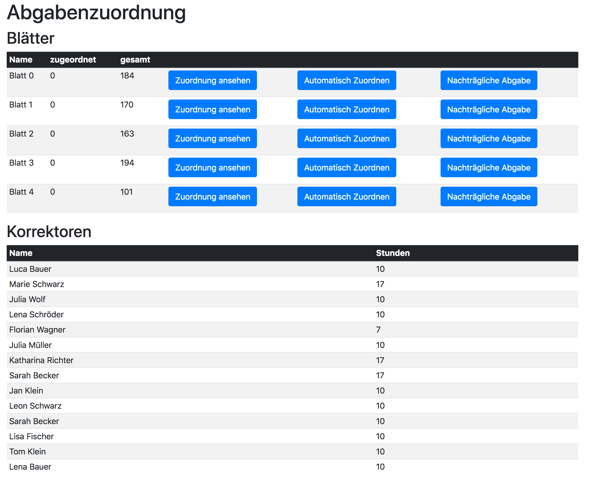

= Kata: Abgabenverteilung
:icons: font
:icon-set: fa

== Problemstellung

In einer Informatikveranstaltung an einer Universität ist es üblich, dass Studierende Programmieraufgaben in elektronischer Form einreichen. Die Einreichungen werden dann von Hilfskräften korrigiert.

Hilfskräfte werden für 7, 10 oder 17 Stunden eingestellt. Die Einreichungen sollen proportional zur Anzahl der Arbeitsstunden aufgeteilt werden, d.h. eine Korrektorinfootnote:[Ich verwende in der Aufgabenbeschreibung das generische Femininum.], die für 17 Stunden eingestellt wurde soll mehr Abgaben erhalten, als eine Korrektorin, die nur 7 Stunden arbeitet.
Es wird Korrektorinnen geben, die überproportional viele Abgaben erhalten, da die Anzahl der Einreichungen in der Regel nicht glatt aufgeteilt werden kann. Wir bezeichnen das als Überhang. Es soll über die Zeit eine faire Zuordnung der Überhänge geben, d.h., es darf keine Korrektorin systematisch benachteiligt werden. Bei der Zuordnung müssen  also die vorangegangenen Zuordnungen mit berücksichtigen.

== Die Anwendung

Die Anwendung ist eine Spring Boot Webanwendung. Sie kann aus der IDE heraus oder mit `gradle bootRun` gestartet werden. Es wird ein Webserver auf dem lokalen Port 8080 gestartet. Wenn bereits eine Anwendung auf Rechner läuft, die Port 8080 belegt, können der Port in der Datei `application.properties` umkonfiguriert werden. Nachdem der Server gestartet wurde, kann die Anwendung im unter `http://localhost:8080` oder `http://127.0.0.1:8080` aufrufen werden.

In der Benutzeroberfläche der Anwendung ist im unteren Teil eine Liste der Korrektorinnen und der wöchentlichen Stunden. Im oberen Teil sind die Übungsblätter.

Pro Blatt B gibt es drei Buttons mit folgenden Funktionen:

* Der erste Button zeigt, wie die Abgaben für Blatt B auf die Korrektorinnen zugeordnet sind.
* Der zweite Button ordnet die offenen Abgaben für Blatt B und alle vorhergehenden Blätter zu.
* Der dritte Button erzeugt neue Abgaben. Der Button ist nur verfügbar, wenn es noch kein neueres Blatt gibt, das schon zugeordnet wurde.

Diese Logik ist gedacht um Ihre Aufgabe etwas leichter zu machen. Sie können nämlich bei der Implementierung der fairen Verteilung folgende Annahmen treffen:

. Wenn ein Blatt zugeordnet wird, sind bereits alle älteren Blätter zugeordnet.
. Wenn ein Blatt zugeordnet wird, kann es keine neuen Abgaben für ältere Blatter geben.
